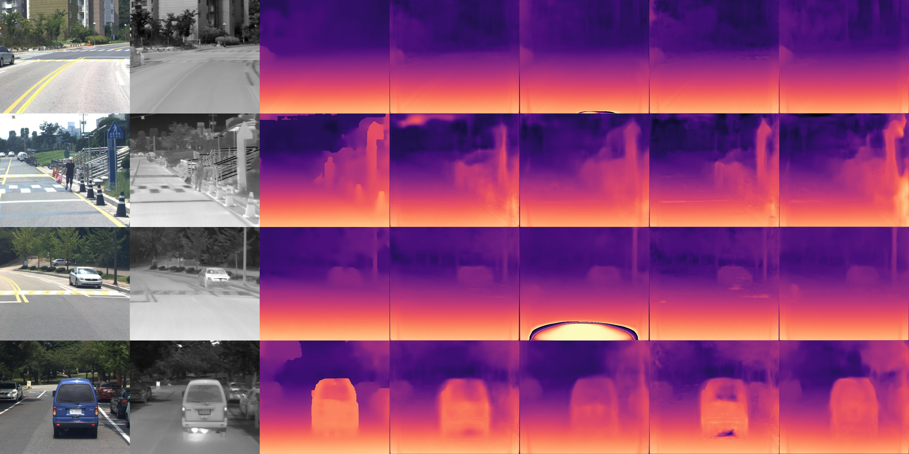
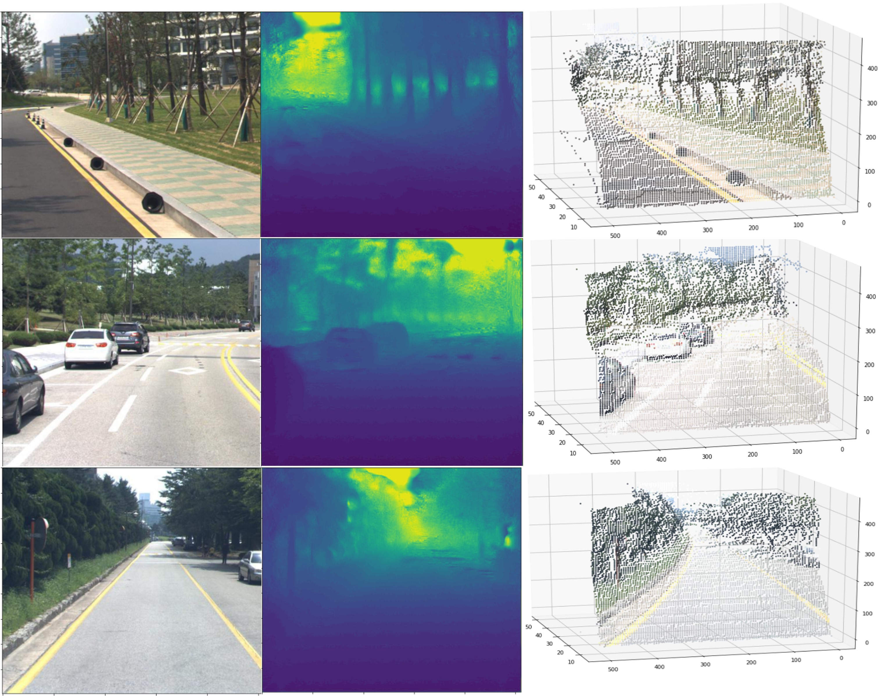

# Pseudo-Lidar

## Dataset

### KAIST TITS 2018

실험한 알고리즘은 학습 시에는 Stereo-pair images와 테스트 시에는 single image가 필요하다.
학습과 테스트는  KAIST TITS 2018 데이터 셋을 사용했다.
학습에는 3037 장,테스트에는 1784 장이 포함되어있다. 

## Dataloader
Dataloader는 폴더의 다음 구조를 가정합니다 ("data_dir" 에는 Kaist_data이 들어가야한다.)
왼쪽 영상의 경우 LEFT 폴더 속에있고 , 오른쪽 영상의 경우 RIGTH에 있으니 찾기 쉬울 것이다. <b>그리고 데이터를 불러오기 위한 txt 파일은 Kaist에서 제공되는 것이 아니니 ```cp``` 나 ```mv```를 이용해 txt를 옳겨줘야한다.</b>

예 ) 데이터 폴더 구조 (이 예에서는 "Kaist_data" 디렉토리 경로를 'data_dir' 로 전달해야 한다 ) :
```
data
├── Kaist_data
│   ├── training
│   │   ├── Campus
│   │   │   ├─ DEPTH
│   │   │   │   ├── DEPTH_000000000.mat
│   │   │   │   └── ...
│   │   │   ├─ LEFT
│   │   │   │   ├── LEFT_000000000.jpg
│   │   │   │   └── ...
│   │   │   ├─ RIGTH
│   │   │   │   ├── RIGHT_000000000.jpg
│   │   │   │   └── ...
│   │   │   ├─ THERMAL
│   │   │   │   ├── THERMAL_000000000.jpg
│   │   │   │   └── ...
│   │   ├── Urban
│   │   │   ├── DEPTH
│   │   │   │   ├── DEPTH_000000000.mat
│   │   │   │   └── ...
│   │   │   └── ...
│   │   └── ...
│   ├── testing
│   │   ├── Campus
│   │   │   ├─ DEPTH
│   │   │   └── ...
│   │   └── ...
│   ├── txt
│   │   ├── train.txt
│   │   ├── test.txt
│   │   ├── test_depth.txt
│   └── ...
├── models
├── output

```

## train
- 학습하기 위한 간단한 실행 명령어는 train.sh 에 있으며, 데이터 경로를 맞춰주고 train.sh을 실행 시켜주면 학습이 될 것이다.
   - 이 경우 모델의 입력은 칼라영상이며 loss는 default L1 loss를 사용한다. 
```
bash train.sh
```
- 열화상 영상을 입력으로 사용하면 다음 명령어를 사용하면 된다.
```
python main_monodepth_pytorch.py  --model resnet18_md --model_path models/resnet18_md
```
- 열화상 영상을 입력으로 사용하고, Loss를 Smooth L1 loss로 변경해 학습하려명 다음과 같은 명령어를 사용하면 된다. 
```
python main_monodepth_pytorch.py  --model resnet18_md --model_path models/resnet18_md_sl1 --l_type sl1
```
- 학습과 테스트시 main_monodepth_pytorch.py 를 사용하고 학습시 argument는 다음과 같다. :
 - `data_dir`: 학습 혹은 테스트 데이터 경로
 - `val_data_dir`:  validation 데이터 경로
 - `model_path`: 모델이 저장될 경로와 어떤 모델인지 이름으로 구분
 - `output_directory`: 테스트시 Depth 영상이 저장될 경로
 - `input_height` : 입력 영상 높이
 - `input_width` : 입력 영상 넒이
 - `model`:  encoder 모델 (resnet18_md or resnet50_md or any torchvision version of Resnet (resnet18, resnet34 etc.)
 - `pretrained`: Pretrained 된 resnet 모델을 사용할 경우 사용
 - `mode`: train or test
 - `epochs`: number of epochs,
 - `learning_rate` 
 - `batch_size` 
 - `adjust_lr`: Learning-late schedular를 사용할 것이지
 - `tensor_type`:'torch.cuda.FloatTensor' or 'torch.FloatTensor'
 - `do_augmentation`:do data augmentation or not
 - `augment_parameters`:lowest and highest values for gamma, lightness and color respectively
 - `print_images` : 학습시 영상을 저장하면서 할 것인지
 - `print_weights` : 학습시 모델을 출력할 것인지
 - `input_channels`: Number of channels in input tensor (3 for RGB images)
 - `num_workers`: Number of workers to use in dataloader
 - `RGB` : 모델의 입력으로 RGB를 사용할 것인지 아니면 열화상 영상을 사용할 것인지 


## test
테스트 argument는 학습과 동일하며 테스트 하기 위한 실행 명령어는 test.sh 에 있으니 그것을 실행 시키면 된다.

```
bash test.sh
```

### Requirements
This code was tested with PyTorch 0.4.1, CUDA 9.1 and Ubuntu 16.04. Other required modules:

```
torchvision
numpy
matplotlib
```


# Result
## 정량적 평가
- 칼라 영상(RGB)과 열화상영상(Thermal) 각각을 깊이 추정 모델의 입력 영상으로 사용하여 추정된 깊이 정보의 정확도를 분석
| model |  입력영상| RMSE <50| RMLSE<50 | RMSE <80| RMLSE<80 |
|:-----: | :-----:|:-----: |:-----: |:-----: |:-----: |
| Monodepth |   칼라  |  4.2886 |  0.2038  | 4.2886 | 0.2038 |
| Monodepth |   열화상 |  4.7079 |  0.1988 | 4.7079 | 0.1988 |

- 베이스 라인 방법론에 멀티스펙트럴 데이터셋을 적용했을 경우 문제되는 Depth Hall을 줄이기 위해 Balanced L1 loss , Smooth L1 Loss 적용 성능
| model |  입력영상| RMSE <50| RMLSE<50 | RMSE <80| RMLSE<80 |
|:-----: | :-----:|:-----: |:-----: |:-----: |:-----: |
| Monodepth |   칼라  |  4.2886 |  0.2038  | 4.2886 | 0.2038 |
| Monodepth+Balanced L1 loss |   칼라 |  4.4707 |  0.1880 | 5.5746 | 0.1955 |
| Monodepth+Smooth L1 loss |   칼라  |  4.3035 |  0.1805  | 5.1633 | 0.1895 |
| Monodepth |   열화상 |  4.7079 |  0.1988 | 4.7079 | 0.1988 |
| Monodepth+Balanced L1 loss |   열화상  |  4.7470 |  0.1941  | 5.8399 | 0.2058 |
| Monodepth+Smooth L1 loss |   열화상 |  4.4529 |  0.1830 | 5.1450 | 0.1897 |


## 정성적 평가
- 자가 학습 기반 깊이 추정 모델(Pseudo-Lidar)의 정성적 결과
 (그림 1) 왼쪽 칼라영상, 열화상영상, 정답 Disparity 영상, 칼라 영상을 이용한 베이스라인 결과 , 열화상영상을 이용한  베이스라인 결과, 칼라 영상을 이용한 제안된 방법론 결과, 열화상 영상을 이용한 제안한 방법론 결과
- 열화상 영상을 이용하여 추정된 깊이 정보를 3D 공간상으로 투영한 정성적 결과
 (그림 2) 왼쪽 부터  열화상 영상 , 추정된 깊이 영상,  추정된 Pseudo-Lidar 
- 칼라 영상을 이용하여 추정된 깊이 정보를 3D 공간상으로 투영한 정성적 결과
 (그림 3) 왼쪽 부터  칼라 영상 , 추정된 깊이 영상,  추정된 Pseudo-Lidar 


