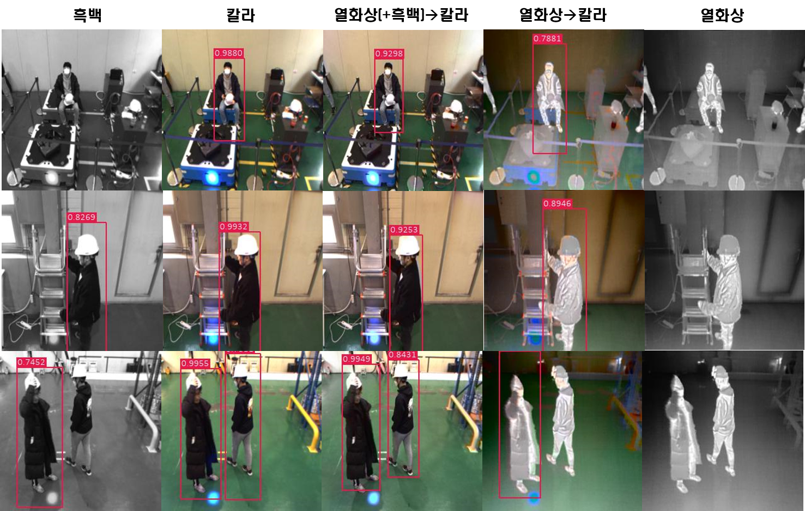

# Pseudo-RGB
- 주야간 관계없이 사용 가능한 Pseudo-RGB 기술 개발을 위해 시작된 연구로, Colorization 모델을 이용해 열화상 영상을 컬러 영상으로 변환하고자 한다.
- 기존 Colorization의 경우 영상 전체를 입력으로 하여 영상을 colorization하고자 하였으나, 이는 다수의 물체가 나오거나 물체와 배경이 뚜렷하지 않을 경우, 물체에 대한 색상이 선명치 못하고 배경색에 덮혀버리는 문제가 발생한다. 이를 해결하고자 영상 내 각 물체에 대해서 Colorization하는 방법론이 제안되었으며, 해당 방법론을 이번 연구에 베이스로 설정하였다. Instance aware Image Colorization은 총 3개의 네트워크로 구성되어 있으며, 각각 전체 영상, 물체 영역 영상, 전체와 물체 영역을 fusion한 영상을 입력으로 한다. 실험 결과는 아래에서 확인 가능하다.
## Dataloader

데이터는 아래 구조와 같이 구성되어야만 한다.

```
datas
├── train
│   ├─ RGB
│   │   ├── LEFT_000000000.jpg
│   │   └── ...
│   ├─ THER
│   │   ├── THER_000000000.jpg
│   │   └── ...
├── test
│   ├─ RGB
│   │   ├── LEFT_000000000.jpg
│   │   └── ...
│   ├─ THER
│   │   ├── THER_000000000.jpg
│   │   └── ...
```

이때 RGB의 영상명이 LEFT로 되어있는데, 이는 KAIST DATASET에서 제공되는 left RGB을 사용하기 때문이므로, 파일이름은 크게 신경 쓸 필요가 없다.

만약 Pseudo-Lidar와 동일한 데이터 폴더 구조를 가지고 있다면 아래와 같이 sum_image.py를 실행함으로써 위의 구조로 변경가능하다. 
```
python sum_image.py --train
```
--train argument를 추가 시 train data만을 불러오며, train argmuent를 제외하면 test data를 불러온다.
## Install other dependencies
```
sh scripts/install.sh
```

## train

1. 학습에는 train.py 파일을 사용하며 이때 사용되는 주요 argument는 다음과 같다. :
 - `stage`: 해당 모델은 총 3개의 network로 구성되어 있으며 학습시킬 네트워크 구간을 의미함.
 - `train_color_img_dir`: 학습할 RGB 영상의 폴더 경로
 - `train_thermal_img_dir`: 학습할 Thermal 영상의 폴더 경로
 - `name`: 실험결과가 저장되는 폴더 이름, 모델의 체크포인트가 해당 폴더에 저장됨.
 - `input_ther` : Thermal 영상을 학습시키는지, grey 영상을 학습시키는지 설정.

 그 외에 다른 argument들은 ./options/train_options.py에서 확인 가능하다.

2. scripts/prepare_train_box.sh'sL1과 scripts/train.sh's L1에 데이터 경로를 알맞게 맞춘 후 Instance Prediction을 먼저 실행한다.
```
sh scripts/prepare_train_box.sh
```
검출된 Instance box는 $DATASET_DIR 폴더에 저장된다. 

3. 전체 학습 과정을 간단하게 실행시키기 위한 명령어는 아래와 같다.
```
sh scripts/train.sh
```
학습 과정은 3단계로 진행된다.
a. 전체 영상에 대한 Colorization network(Full network)를 학습한다.
b. a에서 학습한 Full network의 checkpoint를 사용하여 instance Colorization network(Instance network)를 학습한다.
c. 마지막으로 Full network와 Instance network를 fusion한 fusion network를 학습한다.

## test
학습된 체크포인트들은 checkpoints/mask 폴더 내에 존재한다. 만약 학습하지 않고 미리 제공된 체크포인트로 평가하려면 [해당 드라이브](https://drive.google.com/file/d/1yl7UG8bGAj25aJwDtvkicr8vAFxDz-6a/view?usp=sharing)에서 체크포인트를 다운받아 checkpoints/mask 폴더 내에 저장한 후 평가한다.

아래 명령어를 실행하면 학습된 모델을 이용하여 colorization 된 영상이 생성되며 이는 $DATASET_DIR에 저장된다.
```
bash test.sh
```
정량적 결과를 확인하기 위해서 eval.py 내 predict 폴더 경로를 맞춘 후 아래 명령어를 실행한다.
```
python eval.py
```
##Demo
test_mask.sh 파일에 INPUT_DIR을 example로 변경 후 아래 명령어를 실행하면 example image에 대한 Colorization을 사용가능하다.
```
bash test.sh
```
# 평가
## Dataset
- KAIST Multispectral Dataset
KAIST Multispectral Dataset은 캠퍼스, 도심, 주거지 등 다양한 환경과 낮, 밤에 다양한 시간대에서 촬영된 데이터 셋으로, 쌍을 이루는 컬러 스테레오 영상과 열화상 영상을 제공한다. 모든 영상들은 정합이 이루어져있으며 영상 외에 3D points, annotation 등도 제공하기에 깊이 추정, 보행자 인식, 위치 인식, 컬러 추정 등 다양한 연구 분야에 활용되는 데이터 셋이다.

- Sejong Multispectral Dataset
Sejong Multispectral Dataset은 실내물류창고 내 무인지게차의 장애물 회피 연구를 위한 목적으로 촬영되었다. 촬영에 사용된 시스템은 2대의 컬러 카메라와, 2대의 열화상 카메라로 이루어져있어 쌍을 이루는 컬러 영상과 열화상 영상을 제공한다. 주로 물류창고 내 작업자 위치 인식 연구 분야에 활용된다.

## 평가 메트릭
- PSNR
PSNR은 
## 정량적 평가
### Colorization 품질 평가
- KAIST Multispectral Dataset

|  | PSNR↑| SSIM↑ | LPIPS↓ |
|:-----: | :-----:|:-----: |:-----: |
| Gray2RGB    |   35.0415    | 0.9692 | 0.0822 |
| Ther2RGB |   27.9761  |  0.4052 |  0.5074 |

- Sejong Multispectral Dataset

|  | PSNR↑| SSIM↑ | LPIPS↓ |
|:-----: | :-----:|:-----: |:-----: |
| Gray2RGB    |   34.4895    | 0.9519 | 0.0822 |
| Ther2RGB |  27.9214  |  0.4422 |  0.5276 |

### Detection 검출 성능 평가
|  | RGB| Thermal(grey pixel)2RGB | Thermal2RGB | Grey | Thermal |
|:-----: | :-----:|:-----: |:-----: |:-----: | :-----: |
| Color information    |   O    | O | O | X | X |
| mAP(%) | 95.46 |  92.74 | 62.01 | 62.81 | 24.61 |
## 정성적 결과
### Colorization 품질 평가


### Detection 검출 성능 평가



### Reference
- 해당 코드는 [Instance aware Colorization](https://github.com/ericsujw/InstColorization)을 베이스로 하여 작성되었음.
