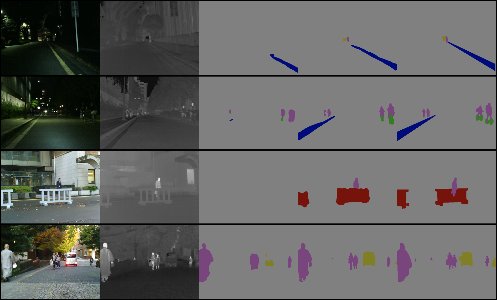

# Semantic-Segmatation

## Requirements

- PyTorch 1.3 to 1.6
- mmsegmantation
  - mmsegmantation 라이브러리로 학습과 평가를 진행하기 때문에 필수로 다운받아야한다. 
  - 라이브러리 다운 순서
  ```
  pip install mmcv-full==latest+torch1.6.0+cu101 -f https://download.openmmlab.com/mmcv/dist/index.html
  pip install mmcv
  pip install mmsegmentation
  ```

## Dataset

### <UTokyo 멀티스펙트럴 데이터셋>
- 도심지에서 낮과 밤 시간대에 촬영된 데이터 셋으로 쌍을 이루는 칼라영상과 열화상 영상을 제공함. 픽셀 단위의 시맨틱 라벨 정보를 제공하고 있어 시맨틱 정보 추정 연구에 활용 됨.

- [데이터 셋 다운 홈페이지](https://www.mi.t.u-tokyo.ac.jp/static/projects/mil_multispectral/) 이곳에서 [Multi-spectral Semantic Segmentation Dataset (link to Google Drive)](https://drive.google.com/drive/u/2/folders/0B7Loi-7ye3pPU2hWUC00djNFU00) 이 링크를 통해서 Dataset을  현재 경로 다운 받아야한다.

- UTokyo Dataset은 칼라영상과 열화상영상을 합쳐서 4채널로 제공은 한다. 따라서 두 도메인의 영상을 따로 다루기 편하도록 칼라와 열화상으로 따로 저장하는 작업이 필요하다.
  - ```Make_split.ipynb```을 이용해 RGB 와 Thermal 를 분리해 저장해야한다. 


## Dataloader


- 데이터 폴더 구조 :
```
data
├── ir_seg_dataset
│   ├── images
│   │   ├── 00001D.png
│   │   ├── 00003N.png
│   │   ├── 00006N.png
│   │   └── ...
│   ├── labels
│   │   ├── 00001D.png
│   │   ├── 00003N.png
│   │   ├── 00006N.png
│   │   └── ...
│   └── ...
├── models
├── output

```

## Train && Test 

### Model (OCR)
-  시맨틱 정보 추출 기술의 베이스라인으로 선정된 OCR  모델은 클래스 물체 영역의 픽셀을 추가적인 정보로 고려하는 방법론이며, 이는 물체의 문맥 정보를 강화해서 보다 정확하게 물체를 표현하려는 장점을 가짐

- 사전 모델 Download
  - OCR 모델을 Cityscape로 사전 학습 시킨 파라미터를 다운받아야 좀 더 수렴이 빨리 이뤄진다.***(필수)***
  ```
  mkdir checkpoints
  wget https://download.openmmlab.com/mmsegmentation/v0.5/ocrnet/ocrnet_hr48_512x1024_160k_cityscapes/ocrnet_hr48_512x1024_160k_cityscapes_20200602_191037-dfbf1b0c.pth -P checkpoints
  ```
### 학습 및 평가 방식 
- 학습과 평가는 코드 하나로 한번에 진행된다.
- 아래 명령어로 실행 시킬 경우 총 10000 iter 돌고 test 해서 성능을 내게 된다. 
   ```python train.py``` 

## Result

### 정량적 평가

- 아래 결과를 통해 낮과 밤 모든 시간대에서는 열화상 영상을 입력으로 사용한 시맨틱 정보 추정의 결과가 칼라영상을 입력으로 사용한 결과 보다 정량 평가(mIoU, mACC)에서 좋은 성능을 나타냄을 확인할 수 있음


| 입력 영상| mIoU | mACC |
| :-----:|:-----: |:-----: |
|   열화상  | 46.46 | 60.9 |
|   칼라  |  42.58 |  48.32  |

(표 1) 낮+밤 에서 정량적 성능평가

- 광량이 풍부한 낮 시간대의 시맨틱 정보 추정 결과는 열화상 영상을 입력으로 사용한 결과와 칼라 영상을 입력으로 사용한 결과에 소폭의 차이가 있으나, 광량이 부족한 밤 시간대의 추정 결과는 열화상영상을 입력으로 사용한 결과가 큰폭으로 좋은 성능을 보임.

| 입력 영상| mIoU (낮)| mACC (낮) | mIoU (밤) | mACC(밤) |
| :-----:|:-----: |:-----: | :-----: |:-----: |
|   열화상    | 37.28 | 51.46 | 48.61 | 60.9 |
|   칼라  |  40.43 |  51.50  |39.32|  44.14  |

(표 2) 낮과 밤에서 각각 정량적 성능평가

### 정성적 평가

